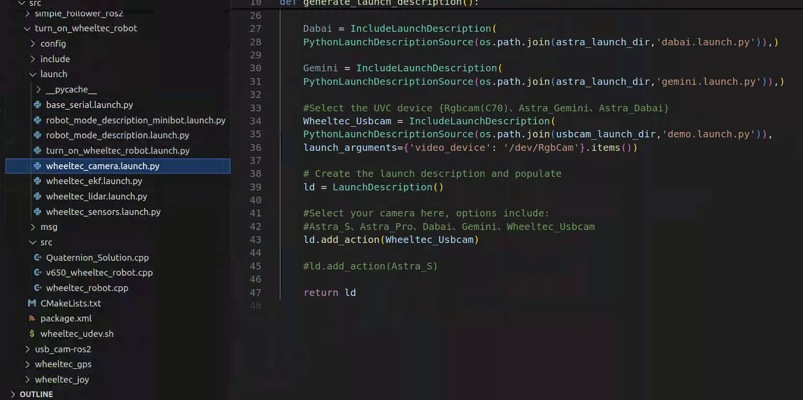
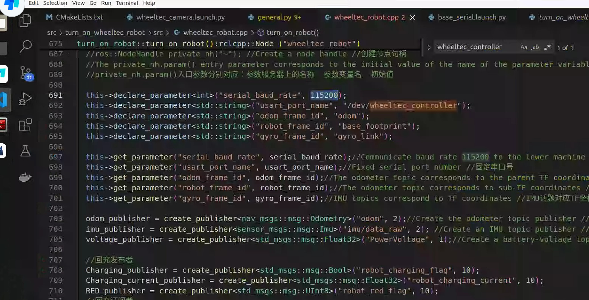
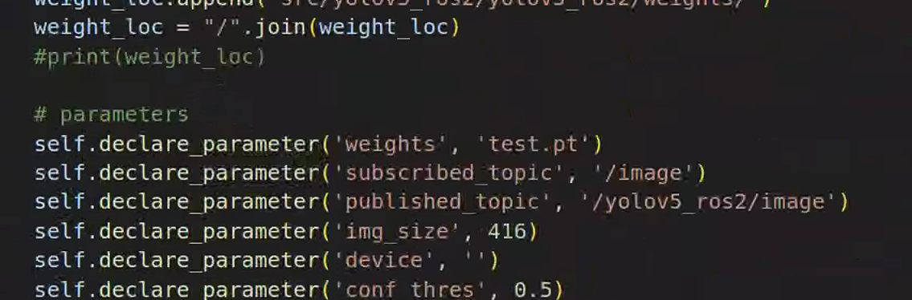
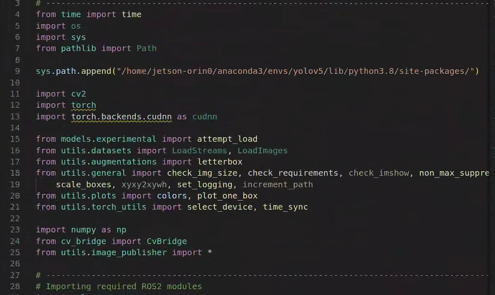
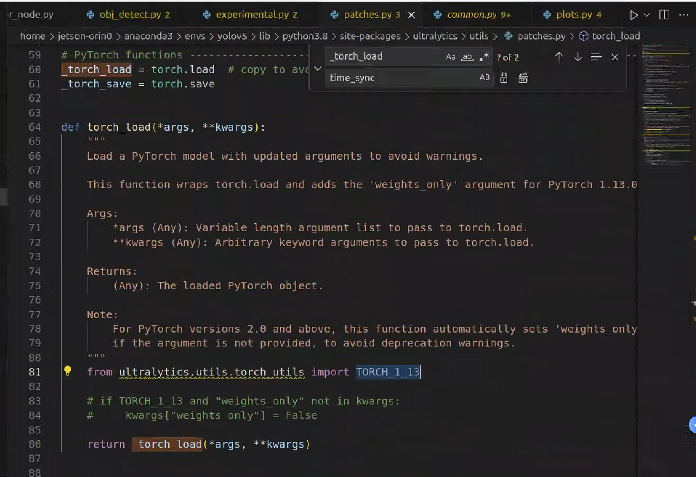
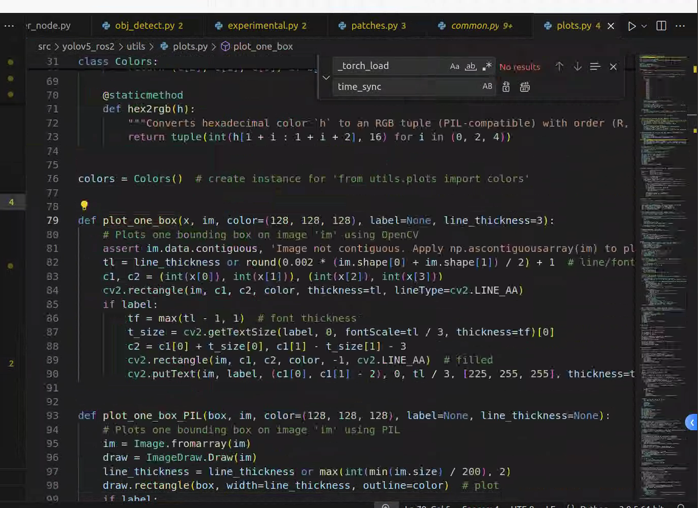

目前成功的是在Galactic环境下

## ROS2多版本共存

首先，机器上是允许共存Galactic和foxy的，打开bashrc可以看到：

```sh
# &gt;&gt;&gt; fishros initialize &gt;&gt;&gt;
echo "ros:foxy(1) galactic(2) ?"
read choose
case $choose in
1) source  /opt/ros/foxy/setup.bash;;
2) source  /opt/ros/galactic/setup.bash;;
esac
# &lt;&lt;&lt; fishros initialize &lt;&lt;&lt;
```

这可以使得每次打开终端时都能设置环境。也就是说装好了ros，不去source它的setup.bash是不能用的

完事后检查ROS版本

```sh
printenv ROS_DISTRO
```

小鱼下载

```sh
wget http://fishros.com/install -O fishros && . fishros
```

## Cutecom

sudo apt install cutecom

## 编译代码

首先创建工作空间

随后在工作空间下创建src文件夹，将Galactic源码全部放入文件夹中，这些都是一个又一个的包

### rosdep替代方案

```sh
sudo pip install rosdepc # 小鱼经典工具
sudo rosdepc init --rosdistro=$ROS_DISTOR
sudo rosdepc update --rosdistro=$ROS_DISTRO

# 在工作空间下, 下载大部分依赖包
rosdepc install --from-paths src --ignore-src -r -y --rosdistro galactic

```

随后需要手动安装大量包(不是很明白为什么不能自动化)

```sh
sudo apt install ros-galatic-usb-cam
sudo apt install ros-galactic-usb-cam
sudo apt install ros-galactic-joint-state-publisher
sudo apt install ros-galactic-async-web-server-cpp*
sudo apt install ros-galactic-cartographer*
sudo apt install ros-galactic-slam-toolbox*
sudo apt install ros-galactic-test-msgs* -y
sudo apt install ros-galactic-behaviortree-cpp-v3* -y
sudo apt install ros-galactic-ompl -y
sudo apt install ros-galactic-async-web-server-cpp* -y
sudo apt install ros-galactic-filters -y
sudo apt install ros-galactic-diagnostic-updater
sudo apt install ros-galactic-gazebo-ros-pkgs -y

sudo apt install ros-galactic-test-msgs*
```

随后需要手动预先编译些msg包

```sh
colcon build --packages-select wheeltec_rrt_msg
# 还有nav2_msgs
source install/setup.bash
```

随后开始整体编译，其中出现了nav2不存在的情况，可能是下载过程中损坏。。。

```sh
sudo apt isntall ros-galactic-nav2-*
```

这是一个稍后需要编译很久的包。。。

### 删除多余包

由于我们不适用Astra相机，故而删除其包，同时在turn_on_wheeltec_robot包内修改相机相关：



为usbcam(虽然之后可能改成gemini)


整体编译，65个包 时长在23分钟左右

编译顺利通过并source后，所有包都能通过tab调用。

期间出现了一个imu_filter_madgwick找不到的情况（运行时才出现，编译时无提示），需要

```sh
sudo apt install ros-galactic-imu-filter-madgwick
```

只能说奇奇怪怪的要求颇多，不记录的话，24h之内忘干净

## 还有一个炸裂的bug



这里居然缺一个115200，真炸裂

### 配置Usb规则

在turn_on_wheeltec_robot下找到wheeltec_udev.sh并在su模式下执行（不然会有权限问题）

随后会得到wheeltec_control这个东西，它是通信串口的别名了

但得不到gemini2相机的别名，似乎是因为我们没有安装相关sdk

### 查看相机设备

```sh
# 如果你没有v4l
sudo apt install v4l-utils

v4l2-clt --list-devices
```

这里实测/dev/video4是gemini2相机的rgb，故而在turn_on_wheeltec_robot的wheeltec_camera_launch.py中将Wheeltec_Usbcam的参数设为/dev/video4

# Yolov5遭老罪

由于训练使用了最新版的yolo代码（看起来pytorch的.pt文件里包含了一定的代码？？？），对于yolov5_ros的融合不算顺利

## pytorch模型保存

在这方面，有些讲究

保存整个模型：

```python
import torch
from models.experimental import attempt_load
from utils.torch_utils import select_device

# 选择设备
device = select_device('cuda')  # 使用GPU

# 加载自定义的YOLOv5模型
model = attempt_load('test.pt', map_location=device)  # 加载模型

# 保存整个模型（包括模型结构和权重）
torch.save(model, 'yolov5_full_model.pt')


import torch

# 加载整个模型
model = torch.load('yolov5_full_model.pt')

# 切换到评估模式
model.eval()
```

保存模型权重

```python
import torch
from models.experimental import attempt_load
from utils.torch_utils import select_device

# 选择设备
device = select_device('cuda')  # 使用GPU

# 加载自定义的YOLOv5模型
model = attempt_load('test.pt', map_location=device)  # 加载模型

# 保存模型权重
torch.save(model.state_dict(), 'yolov5_weights.pth')

import torch
from models.experimental import attempt_load
from utils.torch_utils import select_device

# 选择设备
device = select_device('cuda')  # 使用GPU

# 加载模型结构
model = attempt_load('test.pt', map_location=device)  # 加载模型结构

# 加载模型权重
model.load_state_dict(torch.load('yolov5_weights.pth', map_location=device))

# 切换到评估模式
model.eval()
```

可以见到一些差别。但我想这些是我一年前就知道的东西。

## 下载yolov5_ros2项目

git clone https://github.com/moksh-401-511/YOLOv5-ROS2-YOu-can-Leverage-On-ROS2.git

可以看到这是一个私人小项目，使用的代码是yolo旧版，而需要改为新版

## 从yolov5-master最新版中摘取

### 改动

### python path的添加

```python
from time import time
import os
import sys
from pathlib import Path

sys.path.append("/home/jetson-orin0/anaconda3/envs/yolov5/lib/python3.8/site-packages/") 
```


使用自己的权重文件，修改这里：



此处之后代指yolov5_ros2为旧版本，代指yolov5_master为新版本。替换旧版本models文件夹中的三个核心文件：models.py, experimental.py和yolo.py。

### scale_coord

这个改名了，需要改成scale_boxes。无痛修改，返回的东西较之旧版不变



### save_one_box和time_synchronized()

可见到旧版本save_one_box并没有被使用，如果它报错删掉无妨。

time_syncronized改名了，改成time_sync，无痛修改

### 删除

删除obj_detect.py中的二级classifyer：这段代码中有二级分类模型，需要下载或一些操作，而我们并不需要，故而需要修改以下地方：


把classify删掉，防止引用它时候报错

### 最重量级的

attempt_load存在联网的嫌疑，但经过调查它在当前代码里并不会下载什么。最核心的报错在

```sh
    image_node = ImageStreamSubscriber()
  File "/home/jetson-orin0/SHIYAO YIN/yolo_ws/install/yolov5_ros2/lib/python3.8/site-packages/yolov5_ros2/obj_detect.py", line 91, in __init__
    self.model_initialization()
  File "/home/jetson-orin0/anaconda3/envs/yolov5/lib/python3.8/site-packages/torch/autograd/grad_mode.py", line 27, in decorate_context
    return func(*args, **kwargs)
  File "/home/jetson-orin0/SHIYAO YIN/yolo_ws/install/yolov5_ros2/lib/python3.8/site-packages/yolov5_ros2/obj_detect.py", line 203, in model_initialization
    self.model = attempt_load(self.weights, device=self.device)           # load FP32 model
  File "/home/jetson-orin0/SHIYAO YIN/yolo_ws/install/yolov5_ros2/lib/python3.8/site-packages/models/experimental.py", line 98, in attempt_load
    ckpt = torch.load(attempt_download(w), map_location="cpu")  # load
  File "/home/jetson-orin0/anaconda3/envs/yolov5/lib/python3.8/site-packages/ultralytics/utils/patches.py", line 86, in torch_load
    return _torch_load(*args, **kwargs)
  File "/home/jetson-orin0/anaconda3/envs/yolov5/lib/python3.8/site-packages/torch/serialization.py", line 734, in load
    return _load(opened_zipfile, map_location, pickle_module, **pickle_load_args)
  File "/home/jetson-orin0/anaconda3/envs/yolov5/lib/python3.8/site-packages/torch/serialization.py", line 1069, in _load
    unpickler = UnpicklerWrapper(data_file, **pickle_load_args)
TypeError: 'weights_only' is an invalid keyword argument for Unpickler()
```

这需要修改一处极为神奇的地方：



### 增加

plot_one_box新版是没有的，为兼容旧版，需要手动添加在



```python
def plot_one_box(x, im, color=(128, 128, 128), label=None, line_thickness=3):
    # Plots one bounding box on image 'im' using OpenCV
    assert im.data.contiguous, 'Image not contiguous. Apply np.ascontiguousarray(im) to plot_on_box() input image.'
    tl = line_thickness or round(0.002 * (im.shape[0] + im.shape[1]) / 2) + 1  # line/font thickness
    c1, c2 = (int(x[0]), int(x[1])), (int(x[2]), int(x[3]))
    cv2.rectangle(im, c1, c2, color, thickness=tl, lineType=cv2.LINE_AA)
    if label:
        tf = max(tl - 1, 1)  # font thickness
        t_size = cv2.getTextSize(label, 0, fontScale=tl / 3, thickness=tf)[0]
        c2 = c1[0] + t_size[0], c1[1] - t_size[1] - 3
        cv2.rectangle(im, c1, c2, color, -1, cv2.LINE_AA)  # filled
        cv2.putText(im, label, (c1[0], c1[1] - 2), 0, tl / 3, [225, 255, 255], thickness=tf, lineType=cv2.LINE_AA)
```

